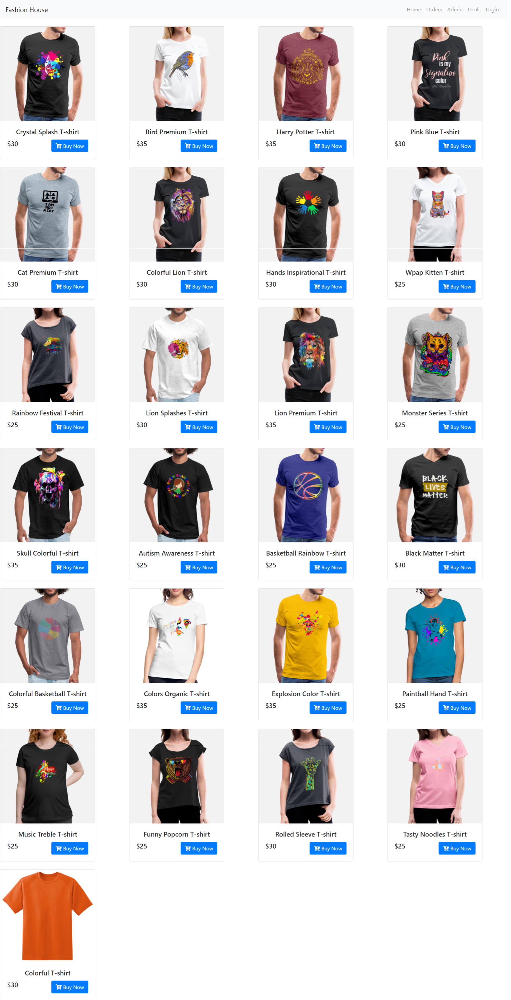
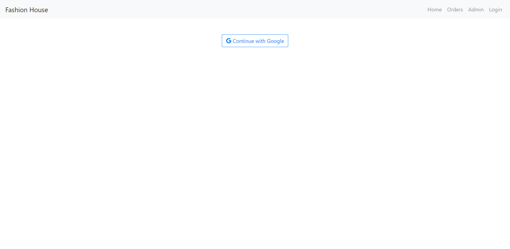
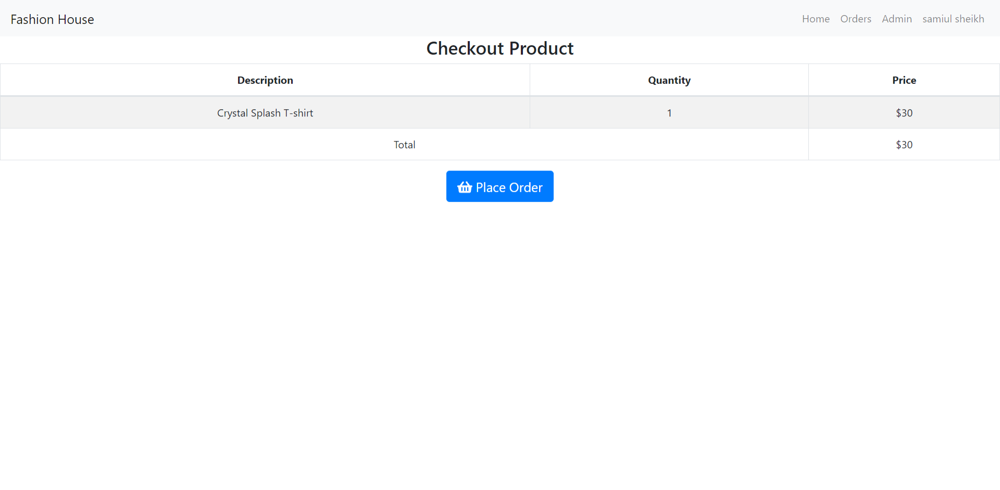
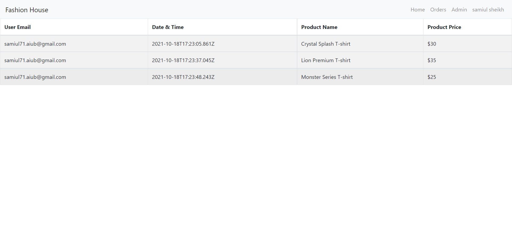

# Fashion House
### `Technology Used`
- React JS
- Node JS
- React Bootstrap
- React Router
- mongoDB
- Express
- FontAwesomeIcon
---
## :link: [See live project here](https://fashion-house-bd.web.app/)

---
### `Project Features`
1. professional looks UI design.
2. set up private route, without Login user can not buy a product.
3. when users click buy, product route will be changed dynamically and go to checkout page.
4. in checkout page user can view product details, if want to order just click to checkout button.
5. in navbar order link users can view theirs all ordered product in a table format.
6. From admin option users can add a new product or delete a product. all information are store in database.
7. Colorful spinner added for homepage loading data.
7. Full Responsive website for web and mobile devices.

### `Server Side Repository`
https://github.com/samiul-sheikh/fashion-house-server

### `Project UI`

